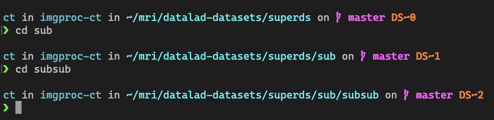

# DataLad starship prompt module

## Usage

Custom module for the [starship prompt](https://starship.rs/) to mark the current [DataLad](https://github.com/datalad/datalad) dataset.

If your current directory is inside a DataLad dataset, the prompt will display the marker `DS~N`, where `N` is the level of the dataset in the nested subataset hierarchy:
- `DS~0`: root superdataset
- `DS~1`: first-level subdataset
- ... etc

 

### Note

- The module considers a nested subdataset any dataset located in a subdirectory of the current dataset, even though not technically installed as a subdataset (e.g. if created by `datalad create` or `datalad clone` without `-d .`).
- Currently only supports bash. Contributions are welcome to make it cross-shell/cross-platform!

## Installation

To enable the module, add the contents of [starship.toml](starship.toml) to your `starship.toml` [config file](https://starship.rs/config/#custom-commands).

:bulb: **Pro tip**: place this module next to the [git branch module](https://starship.rs/config/#git-branch) to see at a glance where you are in both git and DataLad 'space'.
